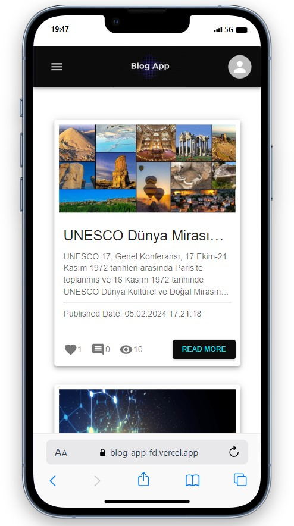
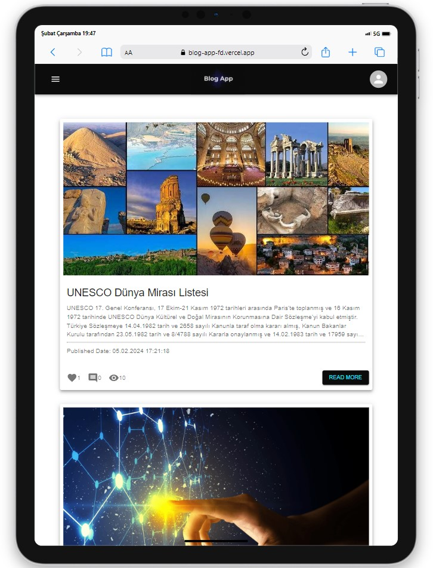
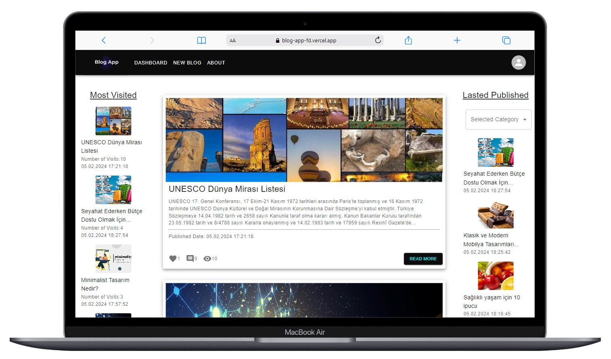

# Blog App

<div align="center">
  
</div>

## About the Project

This project I created with React contains the web version of the blog application. Users can view blog posts, create new posts, edit, delete, comment and like existing posts through this application after registering or logging in.

- Email: guest@site.com
- Password: aA?123456

## Table of Contents

- [Features](#features)
- [Technologies Used](#technologies-used)
- [Usage](#usage)
- [Project Skeleton](#project-skeleton)
- [Screenshots](#screenshots)

## Live Demo

[Blog App](https://blog-app-fd.vercel.app/)

## Features

- Entry and registration procedures
- Pagination for smooth transitions between pages.
- Blog sections that you can add, delete and update yourself

## Technologies Used

- React
- Redux
- Redux-Toolkit
- Axios for API requests
- React-Router-Dom
- Styling with [Material UI](https://mui.com/)
- [React-Toastify](https://fkhadra.github.io/react-toastify/introduction/) for alert 
- [Redux-Persist](https://www.npmjs.com/package/redux-persist) for status data retention.
- [Formik](https://formik.org/) for form management 
- [Yup](https://www.npmjs.com/package/yup) for form validation processes

## Usage

- Create your registration from the Register section or log in from the login section
- Create your own blog
- Viewing blog posts, creating new posts, editing, deleting, commenting and liking existing posts.

## Project Skeleton

```
Blog App (folder)
|
|----readme.md         
SOLUTION
├── public
│    └── index.html
├── src
│    ├── app
│    │     └── store.jsx
│    ├── assets
│    │     └── images
│    ├── components
│    │     ├── auth
│    │     |     ├── LoginForm.jsx
│    │     |     └── RegisterForm.jsx
│    │     ├── blog 
│    │     |     ├── BlogCategories.jsx
│    │     |     ├── BlogCategoriesCards.jsx
│    │     |     ├── Card.jsx
│    │     |     ├── CommentCard.jsx
│    │     |     ├── CommentForm.jsx
│    │     |     ├── DeleteModal.jsx
│    │     |     ├── MostVisited.jsx
│    │     |     ├── MostVisitedCards.jsx
│    │     |     ├── MyBlogCard.jsx
│    │     |     ├── Pagination.jsx
│    │     |     └── UpdateModal.jsx    
│    │     ├── Footer.jsx       
│    │     └── Navbar.jsx  
│    ├── features
│    │     ├── authSlice.jsx
│    │     └── blogSlice.jsx 
│    ├── helpers
│    │     ├── aboutLinks.js
│    │     ├── navbarLinks.js
│    │     ├── ToastNotify.js
│    │     └── updateModalStyle.js
│    ├── hooks
│    │     ├── useAuthCalls.jsx
│    │     ├── useAxios.jsx
│    │     └── useBlogCalls.jsx
│    ├── pages
│    │     ├── About.jsx
│    │     ├── Dashboard.jsx
│    │     ├── Detail.jsx
│    │     ├── Login.jsx
│    │     ├── MyBlog.jsx
│    │     ├── NewBlog.jsx
│    │     ├── NotFound.jsx    
│    │     ├── Profile.jsx    
│    │     └── Register.jsx 
│    ├── router
│    │     ├── AppRouter.jsx
│    │     └── PrivateRouter.jsx
│    ├── App.js
│    └── index.js
├── package.json
└── yarn.lock
```

## Screenshots

<div align="center">
  
  
  
</div>

## Compatibility

The project is compatible with both wide-screen computers and mobile devices.
